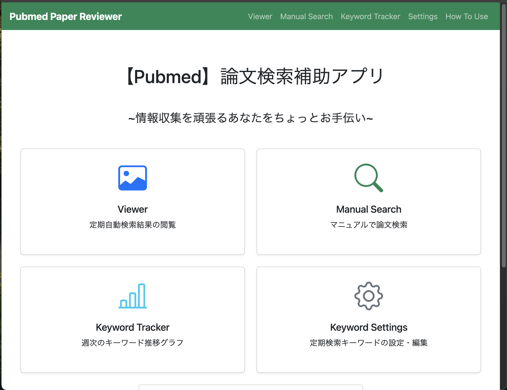

# Pubmed Journal Scraper
## Pubmed論文収集アプリ


本アプリは **Flask** を用いて構築する、研究者向けの論文検索ツールです。あらかじめ指定しておいたキーワードについて**PubMed API**を叩いて論文データを取得し、**Gemini API** を用いてアブストラクトの箇条書き要約を生成します。また、マニュアルでのキーワード検索や、検索キーワード選定用のヒット論文数の描画機能などを備えています。


---

# 🧩　基本機能

## 1. PubMed API を用いた論文収集
- PubmedはAPIを提供しているため、プログラムベースで論文情報を収集することが可能


## 2. Gemini API を使ったアブストラクト要約
- PubMedAPIから抽出したアブストラクトを箇条書き形式で日本語要約を生成
- 無料枠の範囲内であれば、Geminiによる要約を無料で実行することが可能

## 3. 定期検索機能
- アプリ内で設定した検索キーワードについて検索を実行するrun_weekly_search.bat(.sh)をwindowsのxxや、Maxのyyに指定した場合、search_resultフォルダに検索結果がjsonファイルとして保存され、結果をアプリ内で閲覧することができる

## 4. アプリ内での検索キーワード編集
- 定期検索を実行するキーワードはアプリ内で新規登録および編集が可能
- 設定するキーワードについては下のサポート機能を利用して抽象度を調節する


## 5. 検索キーワード調整サポート機能
- 検索キーワードの抽象度が高いと、一度の検索で膨大な数の文献がヒットしてしまい、要約の閲覧が困難となり、また、GeminiAPIの無料枠も有限であることから、一週間あたりの文献数は~10程度が望ましいと考える
- 実際の検索キーワードを設定するにあたって、**入力したキーワードの1週間ごとのヒットした論文集をグラフで表示する**
- この機能によって適切な検索キーワード設定を可能にし、継続的な情報収集を可能にする

## 6. マニュアルサーチ
- アプリ内で手動で検索を実行することも可能
- キーワードを設定し、検索期間を指定して実行すれば定期検索時と同様の出力がページ内に出力される
- このページのデータは保存されないため、あくまで一時的な利用を想定してのものである
- (アップデートでPDFファイルの出力機能実装を検討中・・)

---

# 使い方

## 1. 環境構築
1. リポジトリをGithubからクローンする

```bash
cd YOUR/DIRECTORY
git clone journal_scraprer
```
2. GeminiAPIのキーを取得して、環境変数に`EMINI_API_KEY`として登録
```bash
cd YOUR/DIRECTORY
git clone journal_scraprer
```


## 2. アプリの起動の定期検索用キーワードの設定
1. アプリを起動 (launch_app.py)

```bash
# Poetryから実行する場合
poetry run python app.py

# シェルスクリプトの実行でも起動できる
sh launch_app.py
```

2. `keyword_traker`で検索するキーワードの調整を実施する
    - 一週間あたりのヒットする論文数が過剰になりすぎないように調節する
    


3. `settings`で定期検索するキーワードを新規登録、または修正する
    -  ` 検索タイトル`と`キーワード`を設定する
    - 検索は検索タイトルごとに実行されるが、出力ファイルは一つにまとめられる
    

4. `run_weekly_search.bat`の定期実行設定を実施する
 - windowsであれば`run_weekly_search.bat`を、Macでは``run_weekly_search.sh`を定期実行されるように設定する

## ３. 定期検索結果の閲覧
- `Viewer`上で定期検索結果を閲覧できる
-  過去の検索結果のアーカイブもサイドバーに示されていて、クリックで切り替えることができる


## ４. マニュアルでの検索実行
-  `Manual_search`上で、定期検索以外にマニュアルでの論文検索が実施可能
- キーワードと検索期間を指定して実行すれば、`Viewer`と同様の出力がページ下部に表示される


---

# 📁　　アプリ構成　（エンジニア向け）

```
.
├── app.py
├── cli.                  # 定期検索用CLI
│   ├── config.json.        # 最終検索日のコンフィグファイル
│   └── weekly_search.py　  ＃ 定期検索スクリプト
├── howto
│   ├── __init__.py
│   ├── routes.py
│   └── templates
├── keyword_tracker
│   ├── __init__.py
│   ├── routes.py
│   ├── static
│   │   ├── css
│   │   └── js
│   └── templates
├── manual_search
│   ├── __init__.py
│   ├── routes.py
│   ├── static
│   │   ├── css
│   │   └── js
│   └── templates
├── settings
│   ├── __init__.py
│   ├── routes.py
│   ├── settings.json
│   └── templates
│       ├── keywords_edit.html
│       └── keywords_list.html
├── viewer
│   ├── __init__.py
│   ├── routes.py
│   ├── static
│   │   ├── css
│   │   └── js
│   └── templates
├── static
│   └── css
│       └── base.css
├── templates
│   ├── base.html
│   └── index.html
├── modules
│   ├── gemini_operator.py
│   └── pubmed_operator.py
├── search_result
├── launch_app.sh
├── run_weekly_search.bat
├── run_weekly_search.sh
├── poetry.lock
├── pyproject.toml
└── README.md

```

---

# 🚀 今後拡張予定
- キーワード比較（2語のヒット数を並列評価）
- 要約の深度設定（短め/詳細）
- 日本語翻訳の統合（Gemini or 他API）
- ブックマーク機能（DB導入が必要になった場合）

---

# ✨ 目的
研究者、医療従事者、AI開発者などが、
**最新論文のキャッチアップを高速化し、検索コストや API 利用料を最適化**するためのツールを提供することを目的としています。

## 🌐 Webアプリにした理由
本ツールを **Web アプリケーション** として構築した主な理由は、
**他の文献管理ソフトウェア（EndNote、Zotero、Notion、Obsidian など）との連携を最適化するため** です。

- ブラウザ経由でのデータアクセスが容易
- CSV/Excel などの出力を通じて既存の文献管理ツールにスムーズに取り込み可能
- ローカル環境へのインストールが不要で、マルチデバイスで利用できる
- Web ベースの UI によりコピー、共有、連携がしやすい

こうした点から、研究ワークフロー全体で柔軟に活用できるよう Web アプリ構成としています。

この README はアプリ構成が明確になるよう整理しています。引き続き必要なコードや設計を追加できますので、希望があればお知らせください。

