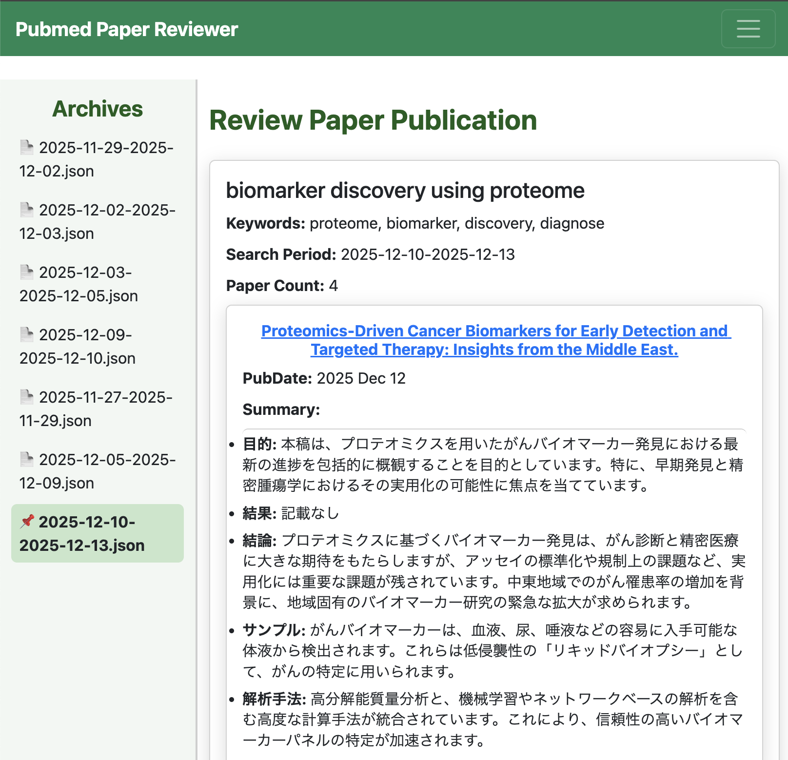
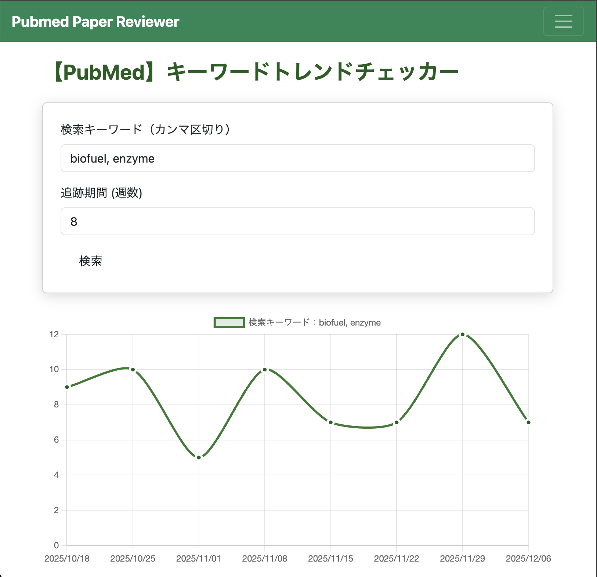
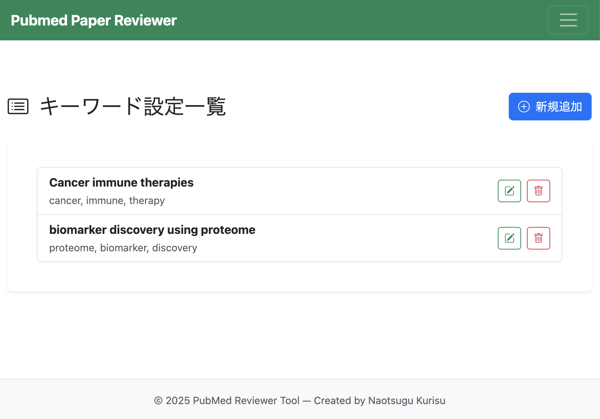
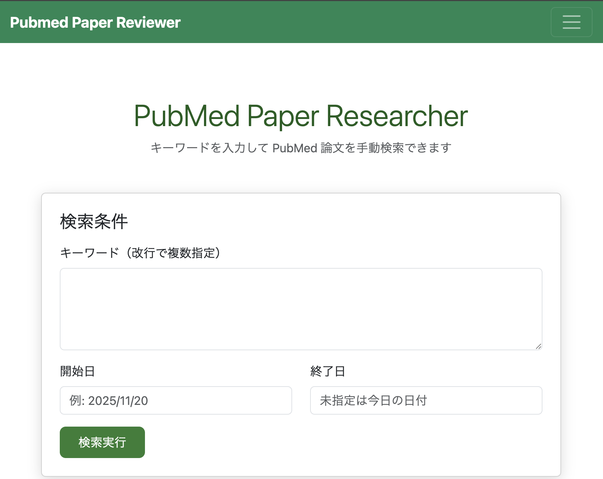

# Pubmed Journal Scraper
## Pubmed論文収集アプリ


本アプリは研究者向けの論文情報収取補助ツールです。あらかじめ指定しておいたキーワードについて**PubMed**から論文データを取得し、**Gemini** を用いてアブストラクトの箇条書き要約を生成します。また、マニュアルでのキーワード検索や、検索キーワード選定用のヒット論文数の描画機能などを備えています。


## 🧩　アプリ解説（ユーザー向け）

### 1. PubMed API を用いた論文収集
- PubmedはAPIを提供しているため、プログラムベースで論文情報を収集することが可能


### 2. Gemini API を使ったアブストラクト要約
- PubMedAPIから抽出したアブストラクトを箇条書き形式で日本語要約を生成
- 無料枠の範囲内であれば、Geminiによる要約を無料で実行することが可能

### 3. 定期検索機能
- アプリ内で設定した検索キーワードについて検索を実行するrun_weekly_search.bat(.sh)をwindowsのxxや、Maxのyyに指定した場合、search_resultフォルダに検索結果がjsonファイルとして保存され、結果をアプリ内で閲覧することができる

### 4. アプリ内での検索キーワード編集
- 定期検索を実行するキーワードはアプリ内で新規登録および編集が可能
- 設定するキーワードについては下のサポート機能を利用して抽象度を調節する


### 5. 検索キーワード調整サポート機能
- 検索キーワードの抽象度が高いと、一度の検索で膨大な数の文献がヒットしてしまい、要約の閲覧が困難となり、また、GeminiAPIの無料枠も有限であることから、一週間あたりの文献数は~10程度が望ましいと考える
- 実際の検索キーワードを設定するにあたって、**入力したキーワードの1週間ごとのヒットした論文集をグラフで表示する**
- この機能によって適切な検索キーワード設定を可能にし、継続的な情報収集を可能にする

### 6. マニュアルサーチ
- アプリ内で手動で検索を実行することも可能
- キーワードを設定し、検索期間を指定して実行すれば定期検索時と同様の出力がページ内に出力される
- このページのデータは保存されないため、あくまで一時的な利用を想定してのものである
- (アップデートでPDFファイルの出力機能実装を検討中・・)

---

## 使い方

### 1. セットアップ

1. GeminiAPIのキーを取得して、環境変数に`EMINI_API_KEY`として登録
```bash
cd YOUR/DIRECTORY
git clone journal_scraprer
```

2. リポジトリをGithubからクローンする

```bash
git clone <repository-url>
cd <repository-name>
```

3. 仮想環境構築
```bash
poetry install # 依存関係インストール
```

### 2. アプリの起動の定期検索用キーワードの設定
1. アプリを起動 (launch_app.py)

```bash
# Poetryから実行する場合
poetry run python app.py

# シェルスクリプトの実行でも起動できる
sh launch_app.py
```

### 3. 起動後、ブラウザで以下にアクセス：
```
http://localhost:5000
```

## 主な画面・機能
1. トップページ
    - アプリ全体の入り口
    - ボタンから任意の機能ページに遷移
    

2. `Viewer`
    - 定期検索設定している場合に、その結果を閲覧するページ
    - 検索タイトルごとに文献の情報がまとめられている
    - 論文タイトルからPubmed論文掲載ページに遷移可能
    - 過去の検索結果のアーカイブもサイドバーに示されていて、クリックで切り替えることができる
    

3. `keyword_traker`
    - 定期検索するキーワードを調節するページ
    - 検索したいキーワードと追跡期間を指定して実行
    - 指定期間において、一週間おきにヒットした論文数が表示される
    - キーワードを調節して、一週間あたりにヒットする論文数が過剰になりすぎないように調節する
    

3. `settings`
    - 定期検索するキーワードを新規登録、または修正するページ
    -  ` 検索タイトル`と`キーワード`を設定する
    

4. `manual_search`
    - 定期検索以外に手動での論文検索を実行するページ
    - 単発での論文検索が可能
    - 検索キーワードと検索期間を指定して実行する (期間未指定の場合は直近一週間に公開された論文が検索される)
    

## 定期検索設定
1. 定期検索を実行するキーワードを`keyword_tracker`で調節
2. `run_weekly_search.bat`の定期実行設定を実施する
    - windowsであれば`run_weekly_search.bat`を、Macでは``run_weekly_search.sh`を定期実行されるように設定する
    - 検索結果は search_result/ に日付付き JSON として保存されます


# 📁　　アプリ解説（エンジニア向け）
PubMed API と Gemini API を利用して、指定したキーワードに基づく論文検索・管理を行う Flask アプリケーションです。
検索結果の閲覧、キーワード管理、定期検索（CLI）などを Web UI とスクリプトの両方から操作できます。

## 特徴
- 🔍 PubMed API を用いた論文検索
- 🤖 Gemini API による検索結果の要約・補助処理
- 🧩 Flask Blueprint による機能単位のルーティング構成
- 🎨 Bootstrap を使ったシンプルな UI
- 🗂 検索結果を JSON ファイルとして保存
- ⏱ 定期検索用 CLI / シェルスクリプト対応


## 🏗 ディレクトリ構成（概要）
```
.
├── app.py                 # Flask エントリーポイント
├── cli/                   # CLI 用スクリプト
├── modules/               # PubMed / Gemini API 操作モジュール
├── search_result/         # 検索結果(JSON)
├── settings/              # キーワード・設定管理
├── viewer/                # 検索結果閲覧
├── keyword_tracker/       # キーワード検索機能
├── manual_search/         # 手動検索
├── howto/                 # 使い方ページ
├── static/                # 共通 CSS
├── templates/             # 共通テンプレート
└── pyproject.toml         # Poetry 設定

```

## 🧩 使用技術

- Python 3.12
- Flask
- Flask Blueprint
- PubMed API
- Gemini API
- Bootstrap（CSS）
- Poetry（依存関係管理）

## ライセンス
This project is licensed under the  
**Creative Commons Attribution-NonCommercial 4.0 International (CC BY-NC 4.0)** license.

- You are free to copy, redistribute, and modify this project.
- **Commercial use is not permitted.**
- Attribution to the original author and this repository is required when reusing or redistributing.

For details, see:  
https://creativecommons.org/licenses/by-nc/4.0/

## 🚀 今後拡張予定
- スクリプト実行中のスピナー表示
- ログイン認証機能
- マニュアル検索機能PDF出力


